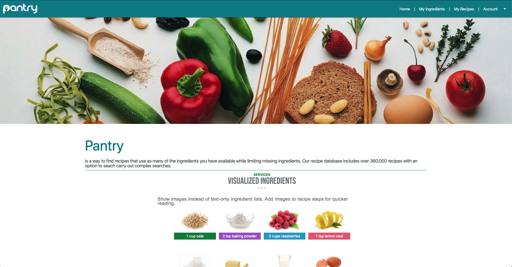
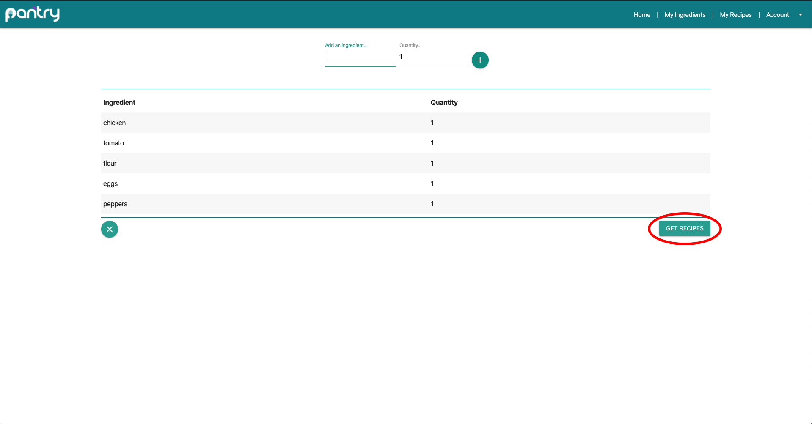

# Project-Pantry
An ingredient tracking web-application

## Project Overview
### Pantry use cases:
#### Whats in my fridge
Find recipes that use as many of the
ingredients you have available while limiting missing
ingredients. This feature will also store users ingredients into a running log.

#### What should I make
Get a list of recipes using a special
ingredient (or several ingredients) that
you want to turn into something
delicious.
Get inspired with the seasonal produce
you found at the farmers’ market or find
the perfect chocolate-cherry-walnut
dessert.

# Functionality
Pantry uses Python and Django on the backend, HTML/CSS, JavaScript, & Materialize on the frontend.
When you arrive at the landing page you will be met with a parallax with some information about the app.

 From there you can either create an account or login, I used Djangos user system to make this happen. After you have logged in you be able to navigate to a 'My Ingredients' tab. Once there you are now able to inventory the ingredients your have on hand OR that you want to use.
 

 From here you can click the get recipes button, once that is clicked it makes a call to the Spoonacular API. You will then be routed to a page consisting of cards with an image of the recipe, a button to make the recipe, and a button to save the recipe. Once you find the recipe of your choice, you can click the make recipe to be routed to a page consisting of ingredients and instructions on how to make that recipe. It also has a button for 'more information',when clicked, it will take you to the website where the original recipe was posted. Pantry allows you to save recipes to your 'My Recipes' view. This view also consists of cards, they are sorted by most recent.

# Data model

Pantry will use a user model, a recipe model, and an ingredient model.

The user model will store a first & last name , username, email address, and password.

The recipe model will store an id, recipe name, recipe ingredients, recipe link.

the ingredients model will store, id, name , a boolean value for having the ingredient or having to buy it.

# Schedule

#### Week 1
I would like to have the general layout of the page done. I want to begin building on the nav during this phase.

#### Week 2
During this phase I hope to start stitching together all the pieces to make web page. I want the nav bar to be functioning by the end of this phase.

#### Week 3
The final phase ... I hope to work out all the bugs and tweak final design during this phase. I would like to have the inventory tool working and completed, as thats the meat and potatoes of the web application.

#### After the dust settles
I hope to add the meal planning feature to allow the users to log recipes for certain days of the week.
